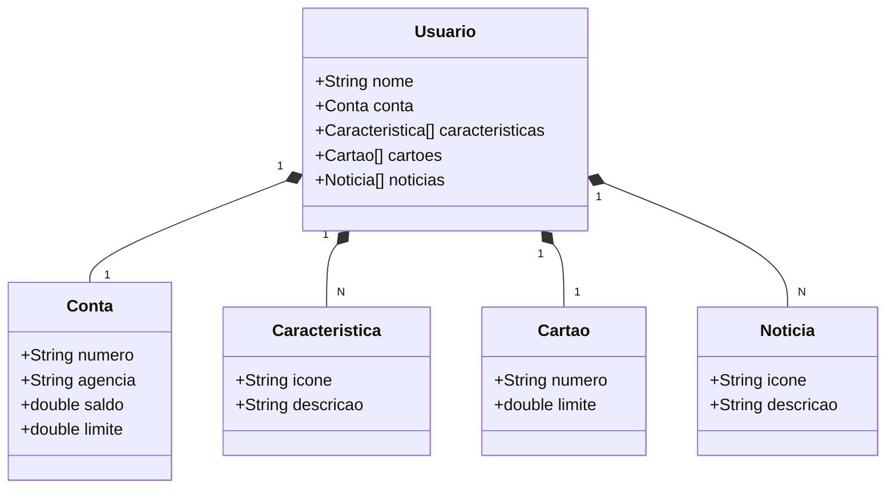

# Spring

Uma API REST funciona como um intermediário entre sistemas. Quando você faz um pedido, como solicitar informações, ela processa e devolve a resposta adequada, tudo isso através da internet seguindo padrões simples de comunicação.

Spring Boot 3 é uma ferramenta que facilita muito a criação de APIs. Ele organiza o trabalho e cuida automaticamente de configurações complexas, permitindo que você se concentre apenas na parte importante do desenvolvimento.

Java 17 é a linguagem de programação utilizada nesse processo. Ela é atualizada, oferece segurança e combina perfeitamente com o Spring Boot 3.

Railway é o serviço que hospeda sua API na internet. Ele elimina a necessidade de configurar servidores complicados - cuida de tudo, desde a publicação da aplicação até a conexão com bancos de dados, e ainda adapta automaticamente a capacidade conforme a demanda.

### Como o desafio foi feito?
O desenvolvimento da API Java com Spring Boot foi realizado utilizando o IntelliJ IDEA, ferramenta que oferece recursos integrados que agilizam o processo de criação. O projeto foi inicializado através do Spring Initializr com as seguintes dependências: Spring Web para construção dos endpoints RESTful, Spring Data JPA para persistência de dados, H2 Database para ambiente de desenvolvimento e testes locais, e PostgreSQL Driver para conexão com o banco de dados em produção.

Inicialmente, implementou-se a lógica da aplicação e os endpoints para tratamento de requisições HTTP, utilizando o banco de dados H2 para testes em ambiente local. Após testes completos e validações, as informações sensíveis foram protegidas através de variáveis de ambiente. O código foi versionado e enviado para o GitHub diretamente pela interface do IntelliJ.

Na fase final, integrou-se o repositório ao serviço Railway, que identificou automaticamente a estrutura Spring Boot, provisionou o ambiente de produção com banco de dados PostgreSQL e realizou o deploy da aplicação. Como resultado, obteve-se uma API totalmente operacional em ambiente cloud, com todo o fluxo de desenvolvimento e publicação realizado de maneira integrada através do IntelliJ, evidenciando como as soluções atuais otimizam a criação e implantação de aplicações.

## Diagrama de Classes

