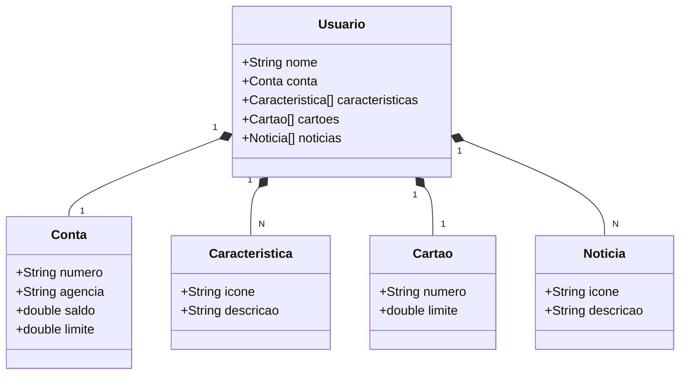

## Diagrama de Classes

```mermaid
classDiagram
    class Usuario {
        +String nome
        +Conta conta
        +Caracteristica[] caracteristicas
        +Cartao[] cartoes
        +Noticia[] noticias
    }

    class Conta {
        +String numero
        +String agencia
        +double saldo
        +double limite
    }

    class Caracteristica {
        +String icone
        +String descricao
    }

    class Cartao {
        +String numero
        +double limite
    }

    class Noticia {
        +String icone
        +String descricao
    }

    Usuario "1" *-- "1" Conta
    Usuario "1" *-- "N" Caracteristica
    Usuario "1" *-- "1" Cartao
    Usuario "1" *-- "N" Noticia


```
